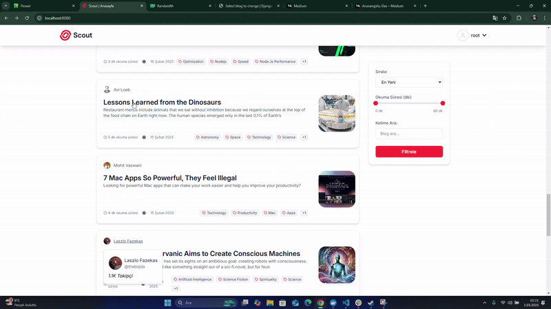
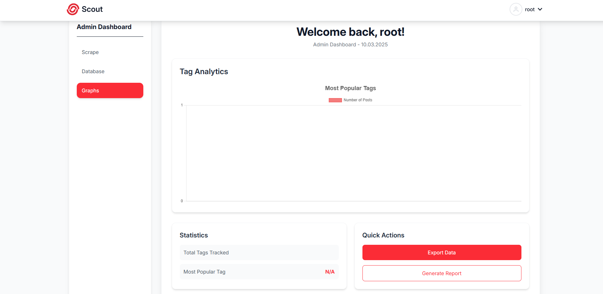
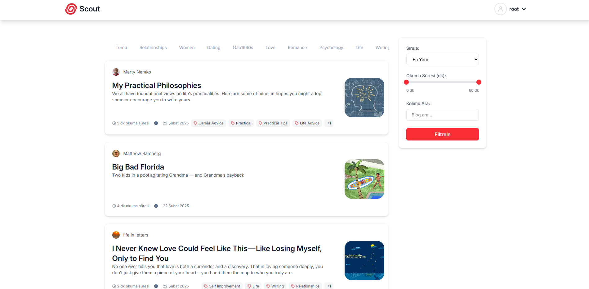

# Scout - Medium İçerik Keşif Platformu

**Scout**, Medium kullanıcılarının blog verilerini otomatik olarak toplayıp analiz eden, mikroservis tabanlı bir veri platformudur. Gerçek zamanlı işlem yetenekleri ve Türkçe dil desteğiyle gelişmiş arama deneyimi sunar.



## 🚀 Bilgisayarımda Nasıl Çalıştırırım?

### 1. Projeyi GitHub'dan klonla
```bash
git clone https://github.com/sizin-kullanici-adiniz/scout.git
cd scout
```

### 2. Sistem Başlatma
```bash
# Tüm servisleri ayağa kaldır
docker-compose up --build -d

# Servis durumunu kontrol et
docker-compose ps
```

### 3. Yönetici Paneli Erişimi
URL: http://localhost:8000/admin

```
Varsayılan Kullanıcı: root

Şifre: root
```
## 🛠️ Kullanılan Teknolojiler

### İstemci (Frontend)
| Teknoloji | Açıklama     |
| :-------- | :------- |
| `React` | `Kullanıcı arayüzü oluşturmak için kullanılan modern bir JavaScript kütüphanesi` |
| `TailwindCSS` | `Hızlı ve esnek stil oluşturma için utility-first CSS frameworkü` |

### Sunucu (Backend)
| Teknoloji | Açıklama     |
| :-------- | :------- |
| `Django` | `Yüksek performanslı ve ölçeklenebilir web uygulamaları için Python tabanlı kütüphane` |

### Veritabanı ve Depolama
| Teknoloji | Açıklama     |
| :-------- | :------- |
| `PostgreSQL` | `ACID prensiplerine uyumlu, hızlı ve ölçeklenebilir açık lisanslı veritabanı yönetim sistemi` |
| `Redis` | `Celery için task kuruğu oluşturmada kullanılan bellek için kütüphane` |

### Arama ve İndeksleme
| Teknoloji | Açıklama     |
| :-------- | :------- |
| `Elasticsearch` | `Apache Lucene üzerinde geliştirilmiş, dağıtılmış bir arama ve analiz altyapısıdır` |

### Konteynerleştirme ve Dağıtım
| Teknoloji | Açıklama     |
| :-------- | :------- |
| `Docker` | `uygulamaları konteynerler içinde paketlemek ve dağıtmak için kullanılan bir platform` |
| `Docker Compose` | ` Çoklu konteyner Docker uygulamalarını tanımlamak ve çalıştırmak için bir araç` |


### Görev Kuyrukları ve Zamanlayıcı
| Teknoloji | Açıklama     |
| :-------- | :------- |
| `Celery` | `Python programlarında asenkron görev yönetimi ve işlemeyi sağlayan popüler bir açık kaynaklı kütüphanedir` |
| `Celery Beat` | `Celery dağıtılmış görev kuyruğu sistemine ait periyodik bir görev zamanlayıcısıdır` |

### Kimlik Doğrulama ve Yetkilendirme
| Teknoloji | Açıklama     |
| :-------- | :------- |
| `JWT (JSON Web Tokens)` | `tarafların birbirleri arasındaki veri alışverişini ve bunun doğrulamasını sağlayan JSON tabanlı RFC 7519'de tanımlanmış açık bir standarttır.` |

### API Geliştirme
| Teknoloji | Açıklama     |
| :-------- | :------- |
| `Django REST Framework` | `Django tabanlı RESTful API'ler geliştirmek için kullanılan bir araç` |

## ⚡ API Kullanımı

Scout platformu, Medium kullanıcı ve blog verilerine erişim sağlayan RESTful API'ler sunar. Tüm endpoint'ler JWT tabanlı kimlik doğrulama gerektirir.

---

### 🔐 Kimlik Doğrulama

#### Token Alma
```http
POST /api/token/
Content-Type: application/json
```
| Parametre | Tip     | Açıklama                |
| :-------- | :------- | :------------------------- |
| `username` | `string` | **Gerekli**. Kullanıcı Adı |
| `password` | `string` | **Gerekli**. Parola |

#### Respone
```json
{
  "refresh": "eyJhbGciOiJIUzI1NiIsInR5cCI6IkpXVCJ9...",
  "access": "eyJhbGciOiJIUzI1NiIsInR5cCI6IkpXVCJ9..."
}
```
#### Token Yenileme
```http
POST /api/token/refresh/
Content-Type: application/json

```

| Parametre | Tip     | Açıklama                |
| :-------- | :------- | :------------------------- |
| `refresh` | `string` | **Gerekli**. Yenileme tokenı |

#### Respone
```json
{
  "refresh": "eyJhbGciOiJIUzI1NiIsInR5cCI6IkpXVCJ9...",
  "access": "eyJhbGciOiJIUzI1NiIsInR5cCI6IkpXVCJ9..."
}
```

### 👤 Kullanıcı İşlemleri
#### Kullanıcı Listesi
```http
GET /api/users/
Authorization: Bearer <access_token>
```

#### Respone
```json
{
  "count": 1200,
  "results": [
    {
      "username": "kemal",
      "name": "Kemal Sunal",
      "followers": 15000,
      "blog_count": 45
    }
  ]
}
```
#### Kullanıcı Listesi
```http
GET /api/users/{username}/
Authorization: Bearer <access_token>
```
| Parametre | Tip     | Açıklama                |
| :-------- | :------- | :------------------------- |
| `username` | `string` | **Gerekli**. aranacak kullanıcı adı |

#### Respone
```json
{
  "username": "kemal",
  "name": "Kemal Sunal",
  "followers": 15000,
  "last_post_date": "2023-10-15",
  "total_read_time": 1200
}
```
### 📝 Blog İşlemleri
#### Blog Arama
```http
GET /api/blogs/?q=django&author=kemal&min_read_time=5&max_read_time=35&page=1
Authorization: Bearer <access_token>
```
| Parametre | Tip     | Açıklama                |
| :-------- | :------- | :------------------------- |
| `q` | `string` | aranacak sorgu kelimesi |
| `author` | `string` | aranacak yazar |
| `min_read_time` | `integer` | en az okuma süresi (dakika) |
| `max_read_time` | `integer` | en fazla okuma süresi (dakika) |
| `page` | `integer` | [Pagination] sayfa numarası |

#### Respone
```json
{
  "count": 15,
  "results": [
    {
      "title": "Django ile Yüksek Performans",
      "author": "kemal",
      "date": "2023-10-01",
      "read_time": 8,
      "content_preview": "Django ORM optimizasyon teknikleri..."
    }
  ]
}
```

#### Blog Detayı
```http
GET /api/blogs/{id}/
Authorization: Bearer <access_token>
```
| Parametre | Tip     | Açıklama                |
| :-------- | :------- | :------------------------- |
| `id` | `string` | **Gerekli**. aranacak blog idsi |

#### Respone
```json
{
  "title": "Django ile Yüksek Performans",
  "author": {
    "username": "kemal",
    "name": "Kemal Sunal"
  },
  "content": "Django ORM optimizasyon teknikleri...",
  "date": "2023-10-01T12:00:00Z",
  "read_time": 8,
  "tags": ["django", "optimization"]
}
```
## 🎨 Renk Referansları

Scout projesinde kullanılan renk paleti, kullanıcı deneyimini geliştirmek ve tutarlı bir tasarım dili oluşturmak için özenle seçilmiştir. Aşağıda projede kullanılan renkler ve kullanım alanları listelenmiştir:

---

### 🖌️ Renk Paleti

| Renk Kodu       | Kullanım Alanı                          | Açıklama                                  |
|-----------------|-----------------------------------------|------------------------------------------|
| `#2c3e50`       | H1 Başlıklar, Kalın Metinler            | Koyu mavi tonu, vurgu ve başlıklar için  |
| `#34495e`       | H2 Başlıklar                           | Orta ton mavi, alt başlıklar için         |
| `#5d6d7e`       | H3 Başlıklar                           | Açık mavi tonu, alt başlıklar için        |
| `#555`          | Paragraflar, Liste Elemanları           | Gri tonu, ana metinler için              |
| `#7f8c8d`       | İtalik Metinler, Resim Alt Metinleri    | Açık gri, ikincil metinler için          |
| `#3498db`       | Linkler                                 | Canlı mavi, tıklanabilir öğeler için     |
| `#1abc9c`       | Linkler (Hover Durumu)                  | Turkuaz, hover etkisi için               |
| `#e74c3c`       | Kod Blokları                           | Kırmızı, kod vurgusu için                |
| `#f4f4f4`       | Kod Blokları Arka Plan                  | Açık gri, kod blokları için              |
| `#fafafa`       | Özel Metin Blokları Arka Plan           | Çok açık gri, özel metinler için         |
| `#e6e6e6`       | Özel Metin Blokları Kenarlık            | Açık gri, kenarlık için                  |

---

### 🎯 Renk Kullanımı

1. **Başlıklar (H1, H2, H3)**  
   - `#2c3e50`, `#34495e`, `#5d6d7e` renkleri başlıklarda hiyerarşi oluşturmak için kullanılır.
   - Koyu tonlar, içeriğin önemini vurgular.

2. **Metinler (Paragraflar, Listeler)**  
   - `#555` rengi, okunabilirliği artırmak için ana metinlerde kullanılır.
   - `#7f8c8d` rengi, italik metinler ve resim alt yazıları gibi ikincil içerikler için tercih edilir.

3. **Linkler**  
   - `#3498db` rengi, linkler için kullanılır ve hover durumunda `#1abc9c` rengine dönüşür.
   - Bu renkler, kullanıcı etkileşimini artırmak için seçilmiştir.

4. **Kod Blokları**  
   - `#e74c3c` rengi, kod metinlerini vurgulamak için kullanılır.
   - `#f4f4f4` rengi, kod bloklarının arka planını oluşturur.

5. **Özel Metin Blokları**  
   - `#fafafa` rengi, özel metin bloklarının arka planını oluşturur.
   - `#e6e6e6` rengi, bu blokların kenarlıklarında kullanılır.

---

### 🖼️ Renk Uyumu

Bu renk paleti, modern ve minimalist bir tasarım dili oluşturmak için seçilmiştir. Renkler, birbiriyle uyumlu ve göz yormayan tonlardan oluşur. Özellikle mavi ve gri tonları, profesyonel bir görünüm sağlarken, turkuaz ve kırmızı renkler etkileşimi artırır.

---

### 🎨 Renk Örnekleri

```html
<h1 style="color: #2c3e50;">H1 Başlık</h1>
<h2 style="color: #34495e;">H2 Başlık</h2>
<h3 style="color: #5d6d7e;">H3 Başlık</h3>
<p style="color: #555;">Bu bir paragraf metnidir.</p>
<a href="#" style="color: #3498db;">Bu bir linktir</a>
<code style="background-color: #f4f4f4; color: #e74c3c;">Kod Örneği</code>
```

---

## 📸 Ekran Görüntüleri

| Admin Paneli | Arama Sonuçları |
|--------------|-----------------|
|  |  |

---
## 🧠 Kazanımlar
### Docker
Multi-Container Uygulama Yönetimi: Docker Compose ile mikroservis mimarisini öğrendim.

Healthcheck ve Dependency Management: Servislerin sağlık durumunu izleme ve bağımlılık yönetimi.

Volume Kullanımı: Veri kalıcılığı için volume'lerin nasıl kullanılacağını öğrendim.

### Celery
Task Queue Yönetimi: Farklı önceliklerde task kuyrukları oluşturmayı öğrendim.

Periodic Tasks: Zamanlanmış görevler için Celery Beat kullanımı.

Worker Scaling: Concurrent worker'lar ile performans optimizasyonu.

### 🔍 Elasticsearch
Full-Text Search: Türkçe dil desteği ile arama optimizasyonu.

Index Management: Veri indexleme ve yönetimi.

Bulk API: Toplu veri işleme ve performans artışı.

### 🧠 Redis
Cache Management: Veri önbellekleme ve performans artışı.

Pub/Sub Pattern: Gerçek zamanlı mesajlaşma ve event-driven mimari.

Atomic Operations: Thread-safe operasyonlar ve veri tutarlılığı.

### Eklenenler:
##### 1. **Kazanımlar Bölümü**: Docker, Celery, Elasticsearch ve Redis ile ilgili öğrenilen detaylar eklendi.
##### 2. **API Dokümantasyonu Genişletildi**: İstatistik ve yönetim endpoint'leri eklendi.
##### 3. **Response Örnekleri**: Her endpoint için detaylı response örnekleri eklendi.
##### 4. **Docker ve Celery Detayları**: Kazanımlar bölümünde bu teknolojilerle ilgili öğrenilen detaylar vurgulandı.
## 📬 Geri Bildirim ve İletişim

Scout projesiyle ilgili geri bildirimlerinizi, önerilerinizi veya sorularınızı aşağıdaki e-posta adresi üzerinden iletebilirsiniz. Geliştirme sürecinde kullanıcı geri bildirimleri bizim için çok değerlidir!

**İletişim Bilgileri:**  
📧 E-posta: [mehmetszr05@gmail.com](mailto:mehmetszr05@gmail.com)  

Geri bildirimlerinizi bekliyoruz! 🚀